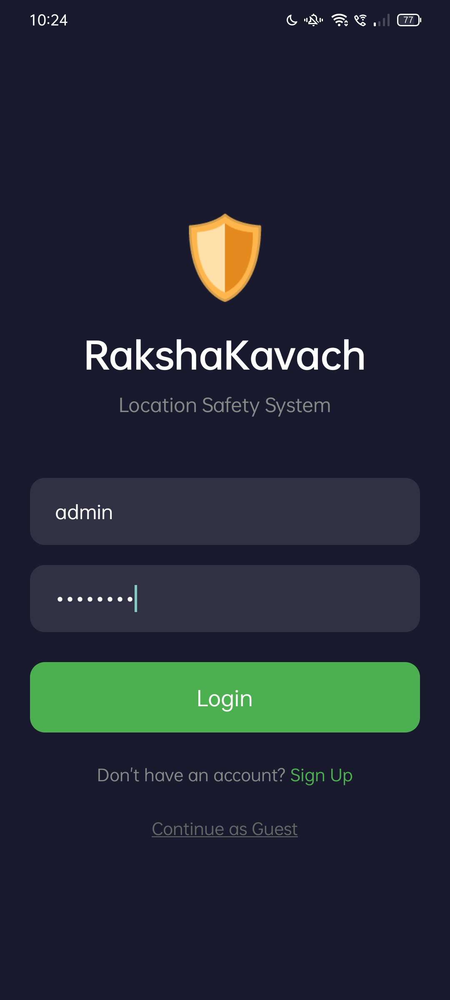
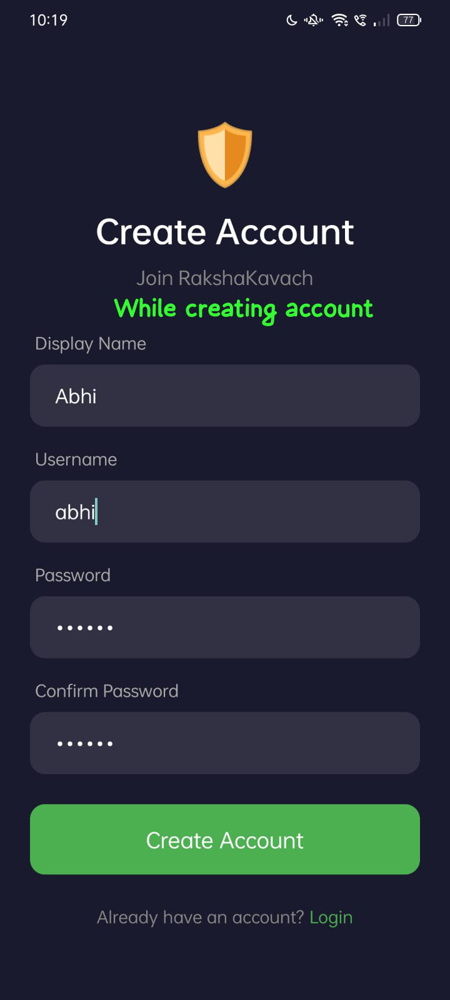
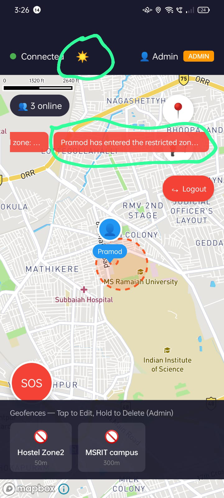
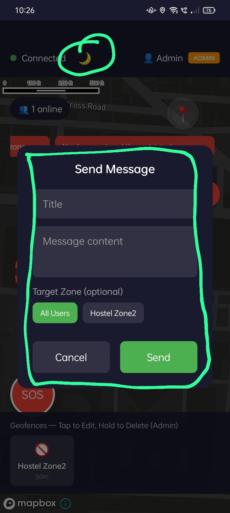
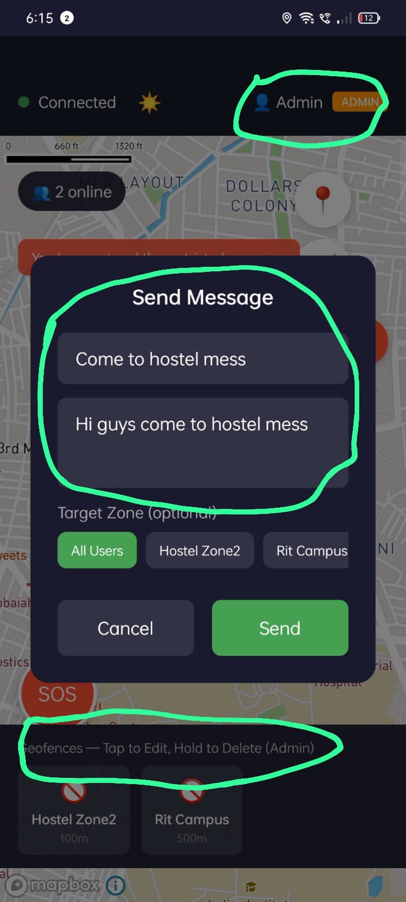
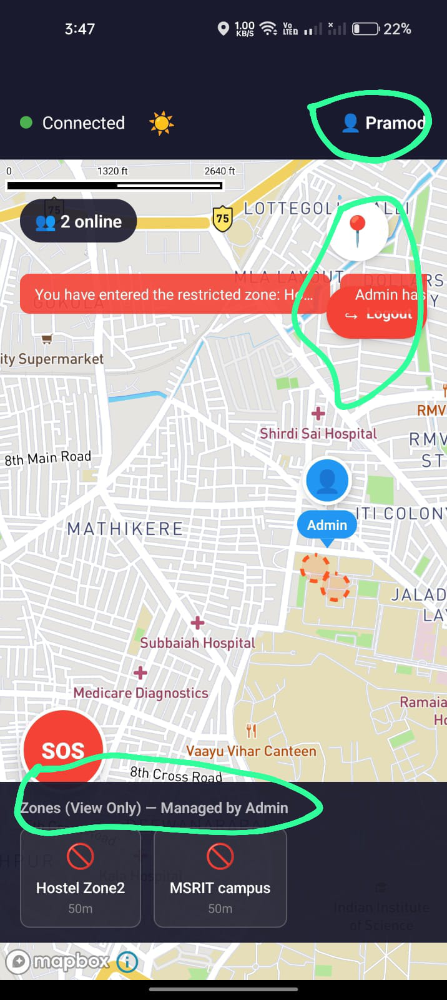
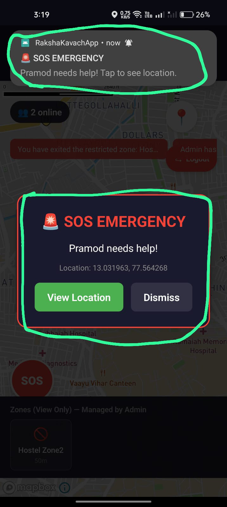
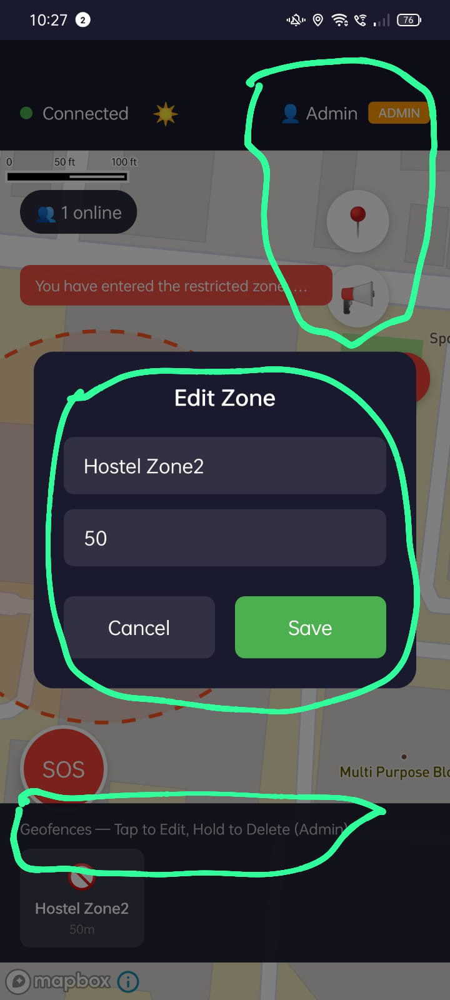

# RakshaKavach

A real-time geofencing safety application for location-based monitoring and emergency alerts.

---

## Demo


---

## Screenshots

| Login | Register |
|-------|----------|
|  |  |

| Map (Light Mode) | Map (Dark Mode) |
|------------------|-----------------|
|  |  |

| Admin View | User View |
|------------|-----------|
|  |  |

| SOS Alert | Zone Management |
|-----------|-----------------|
|  |  |

---

## Problem Statement

Personal safety remains a significant concern, especially in scenarios involving vulnerable individuals, remote workers, or group activities. Traditional safety measures often lack:

- Real-time location awareness
- Immediate emergency response mechanisms
- Centralized control for safety administrators
- Automated alerts when entering or exiting designated areas

There is a need for a modern, mobile-first solution that provides location-based safety monitoring with instant communication capabilities.

---

## Solution Overview

RakshaKavach addresses these challenges through:

- **Geofencing Technology**: Define virtual boundaries that trigger automatic alerts when users enter or exit zones
- **Role-Based Access Control**: Separate capabilities for administrators and regular users
- **Real-Time Communication**: Instant updates and notifications across all connected devices
- **Emergency SOS System**: One-tap emergency alerts that broadcast location to all users

---

## Key Features

### Authentication and Security

- JWT-based authentication system
- Role-Based Access Control (Admin / User)
- Secure password hashing
- Protected admin creation endpoint

### Geofencing

- Create, edit, and delete geofence zones (Admin only)
- View-only access for regular users
- Multiple zone types: Restricted, Safe, Home
- Safe arrival notifications for home zones

### Safety Features

- SOS emergency alert button with location broadcast
- Real-time notifications for zone entry and exit
- Push notifications for all connected users
- Emergency location sharing

### User Experience

- Dark mode map toggle
- Zone color customization
- Clean, role-differentiated UI
- Responsive design for various screen sizes

### Admin Controls

- Broadcast messaging to all users
- Targeted messaging to specific zones
- Centralized zone management
- User activity visibility

---

## Tech Stack

### Frontend

| Technology | Purpose |
|------------|---------|
| React Native | Cross-platform mobile application |
| TypeScript | Type-safe development |
| Mapbox SDK | Map rendering and geofence visualization |
| Socket.IO Client | Real-time communication |
| AsyncStorage | Local data persistence |

### Backend

| Technology | Purpose |
|------------|---------|
| Node.js | Server runtime |
| Express.js | REST API framework |
| MongoDB | Database |
| Mongoose | ODM for MongoDB |
| Socket.IO | Real-time bidirectional communication |
| JWT | Authentication tokens |
| bcryptjs | Password hashing |

---

## System Architecture

The application follows a client-server architecture with real-time capabilities:

1. **Mobile Application**: React Native app handles user interface, location tracking, and local state management

2. **Backend Server**: Node.js server manages authentication, database operations, and business logic

3. **Database**: MongoDB stores user data, geofence configurations, and activity logs

4. **Real-Time Layer**: Socket.IO enables instant communication for location updates, alerts, and notifications

**Data Flow**:
- User actions trigger API calls or socket events
- Backend validates requests based on user role
- Database operations are performed
- Updates are broadcast to relevant connected clients

---

## Application Roles

### User

- Register and login
- View geofence zones on map (read-only)
- Receive zone entry/exit alerts
- Send SOS emergency alerts
- Receive admin messages
- Toggle dark mode

### Admin

- All user capabilities
- Create, edit, and delete geofence zones
- Configure zone properties (name, radius, type, color)
- Send broadcast messages to all users
- Send targeted messages to users in specific zones
- Monitor zone activity

---

## Setup Instructions

### Prerequisites

- Node.js (v18 or higher)
- MongoDB (local or cloud instance)
- Android Studio (for Android development)
- React Native development environment

### Backend Setup

```bash
cd backend
npm install
```

Create a `.env` file with required environment variables (see Environment Variables section).

```bash
npm start
```

### Mobile App Setup

```bash
cd RakshaKavachApp
npm install
```

Configure environment variables for API endpoints.

```bash
npx react-native start
npx react-native run-android
```

### Environment Variables

The following environment variables are required but not included in the repository for security reasons:

**Backend**:
- Database connection string
- JWT secret key
- Admin creation secret
- Server port configuration

**Mobile App**:
- Backend server URL
- Mapbox access token

---

## Screens and UI

### Login and Registration

- Clean authentication forms
- Input validation
- Guest mode option

### Map Screen

- Full-screen map with geofence visualization
- User location marker
- Friend location markers
- Zone entry/exit alert banners

### Admin UI

- Zone management controls
- Message broadcasting interface
- Admin badge indicator

### User UI

- Read-only zone display
- View Only label for zones
- Managed by Admin indicator

### Controls

- SOS emergency button (prominent red)
- Dark mode toggle in status bar
- Location center button
- Logout button

---

## Security Notes

This repository follows security best practices for public sharing:

- All secrets and API keys are excluded from the codebase
- Environment files (.env) are gitignored
- Admin creation requires a server-side secret
- Role assignment is controlled exclusively by the backend
- Passwords are hashed before storage
- JWT tokens are used for stateless authentication

---

## Testing

The application has been tested with:

- Multiple physical Android devices simultaneously
- Real-time validation across different user roles
- Admin to User interaction scenarios
- Zone entry and exit detection
- SOS alert propagation
- Message broadcasting and receiving

---

## Future Enhancements

- Analytics dashboard for zone activity metrics
- Web-based admin panel
- Scheduled alert system
- Improved offline handling and sync
- Push notification history
- User group management
- Route history visualization

---

## Project Structure

```
RakshaKavach/
├── backend/
│   ├── models/          # MongoDB schemas
│   ├── routes/          # API routes
│   ├── services/        # Business logic
│   ├── socket/          # Socket.IO handlers
│   └── server.js        # Entry point
│
└── RakshaKavachApp/
    ├── src/
    │   ├── components/  # Reusable UI components
    │   ├── screens/     # Application screens
    │   └── services/    # API and socket services
    └── App.tsx          # Root component
```

---

## Disclaimer

This project is developed for educational and demonstration purposes. It is not intended for production deployment without additional security hardening, error handling improvements, and infrastructure considerations. Use at your own discretion.

---

## License

This project is available for educational purposes.

---

## Author

Developed as a full-stack mobile application project demonstrating real-time geofencing, role-based access control, and safety-focused features.
